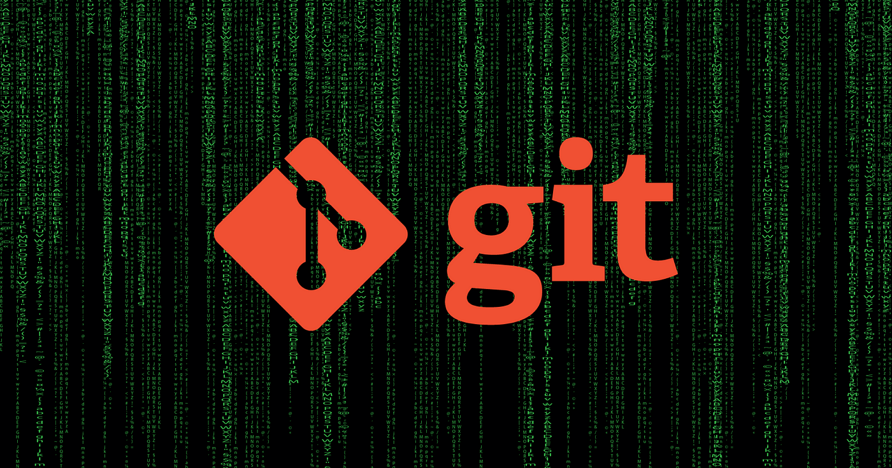

# 

<h1 align="center"> Bizus, git e GitHub - Comandos úteis </h1>



# Tópicos

# Descrição do Projeto
> Link rápido de ajuda para comandos do dia-a-dia 

# Status do Projeto

<p align="center">

</p>

# Comando úteis


# Começando com repositório local e depois subindo atualizações para o repositório remoto
Passo a passo na sequência para ter um projeto versionado localmente, e na nuvem no GitHub. Recomendável criar uma pasta de trabalho para cada projeto. 

1. Crie um diretório para o projeto a ser versionado
1. Abrir um terminal ou abrir sua IDE preferida do diretório criado
1. Iniciar o versionamento do projeto e definindo a branch main como padrão

    ```git init -b main```

1. Verificar o status do repsitório

    ```git status```

1. Ir no [GitHub]() e criar um repositório para esse projeto
1. Apósa criado, é necessário definir no repositório local, o repositório remoto recém criado, ou seja, definir a origem remota. Pode ser com os protocolos https ou ssh. Para usar o SSH que é o recomendado, é necessário criar as chaves locais e colocá-la no GitHub

    ```git remote add origin main https://github.com/LuizPerciliano/vagrant.git```

1. Antes de enviar algo do repositório local para o remoto, primeiramente, é necessário sincronizar o local com o comando
    
    ```git pull origin main```

1. Agora os repositórios estão sincronizados e atualizados. Para testar o versionamento e a subida dos arquivos/diretórios para o `GitHub`, crie um arquivo ou altere o README.md, em seguida verifique o status

    ```git status```

    ```git add README.md ```

    ```git status```

    ```git commit -m “testando a atualizando repositório com o readme”```

    ```git status```

1. Não sei ainda o motivo, no primeiro push tem que ter o upstream, tem algo a ver com a adição do remote e a branch já existente (algo a ser pesquisado)

    ```git push --set-upstream origin main```

1. Agora verificar se o repositório remoto foi atualizado basta acessá-lo

    https://github.com/LuizPerciliano/metamap-portugues 


# ✔️Técnicas e tecnologias utilizadas
- `Git 8`
- `GitHub`
- `HTML`

# Autores


# Licença
`MIT licensed`

# Referencias:
